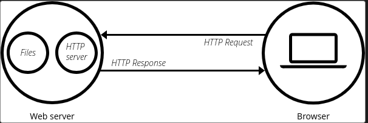

# Explaining the code for the server

# 1. What exactly is a server?
A serve, in simple terms, is basically something that provides resources to those who request for it. It "serves" resources. There are multiple types of servers:
1. __Web Servers__: These host websites. When the user requests for a web page, they give the web page to the user. For example, when you type www.google.com in your browser, the browser (client) request the server (somewhere in the world) for the web page. The server then responds with the web page. After the browser receives the web page, it displays it. There is a server somewhere in the world that stores the google home page, and when any user requests for it, the server gives or serves the web page to the user.
2. __File Servers__: Store and manage files. This allows clients to access them over a network. If a file server is running on a computer, you can access the files stored on the computer remotely.
3. __Database Servers__: Provides various database services like data storage, retrieval and management of database to clients.

There are any more.

So... what is a __HTTP server__?
It is one of the most essential components of a __Web Server__. It understands URLs (web addresses) and HTTP (the protocol your browser uses to view webpages).  

# 2. What is a Protocol?
A protocol is a set of rules which help different computers communicate with each other. IF two different computer use the same protocol, they can communicate with each other. For now, this definition will suffice. 
Now, what is a Hypertext Transfer Protocol (HTTP) then? It was designed for communication between webservers and to transmit hypermedia documents such as HTML.
So, HTTP is basically a set of rules that help in sending and receiving HTML documents. HTTP responses and request look something like this:

read http protocol 
and then explain

# 2. Headers files used

# 3. Network Byte Order vs Host Byte Order

# 4. IPv4 vs IPv6

# 5. TCP and UDP

# 6. High level view of socket programming for web server

# 7. Creating socket

# 8. Binding socket

# 9. Listening

# 10. Accpeting connection

# 11. Sending back a response
